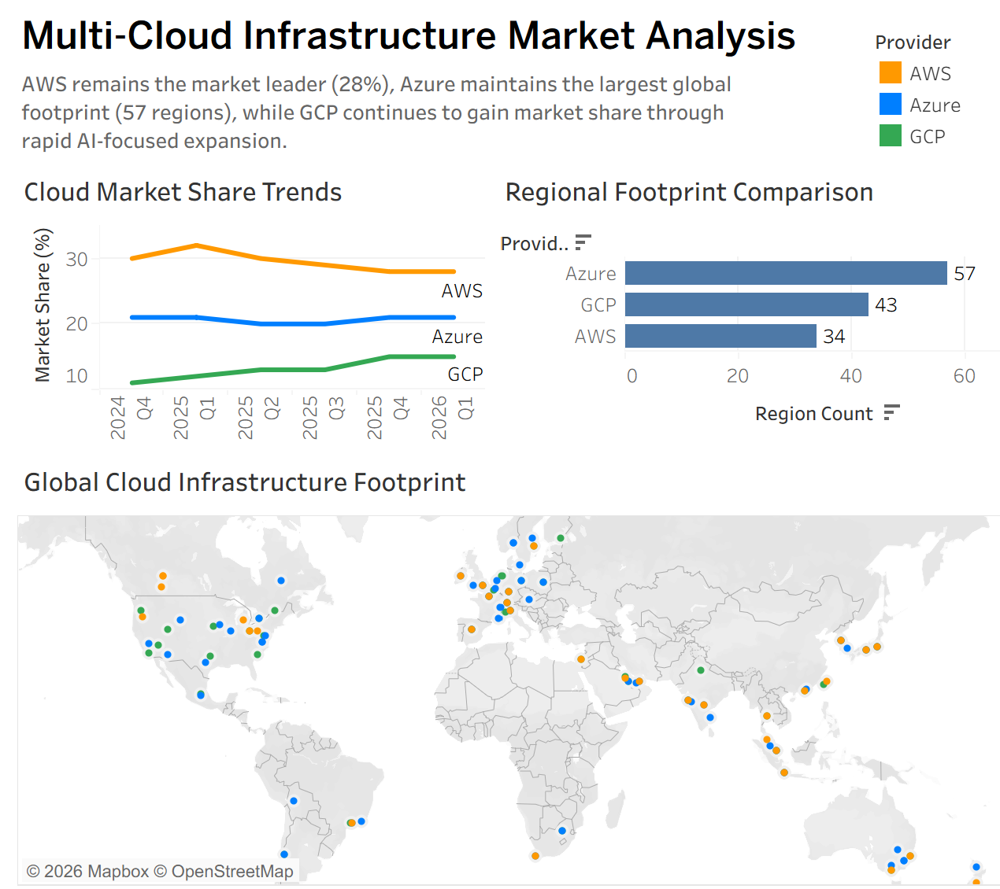
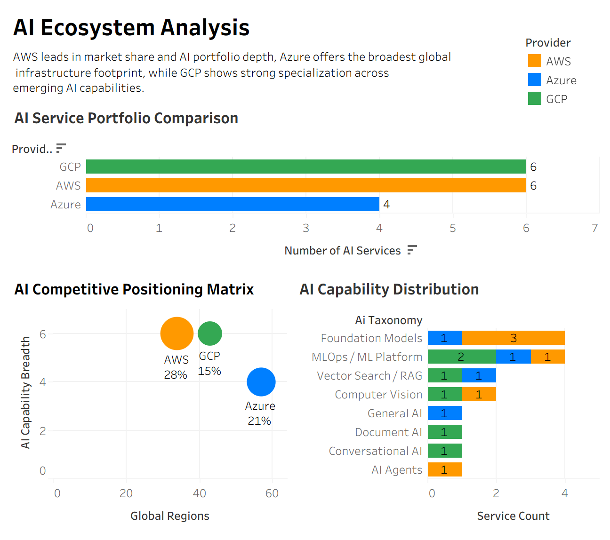
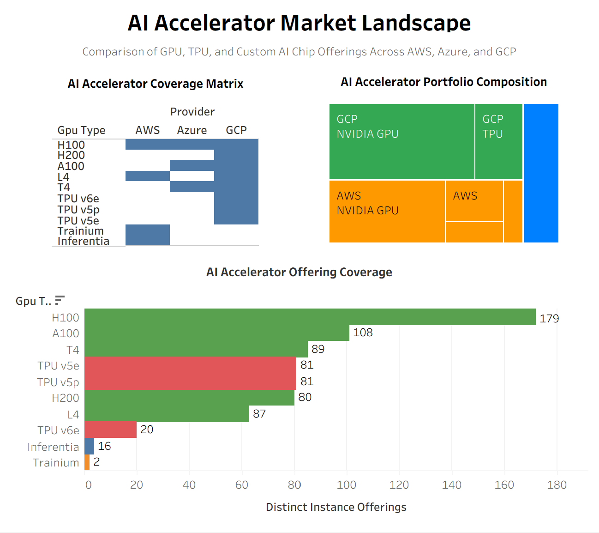

# Multi-Cloud AI Infrastructure Market Analysis

> Head-to-head market intelligence on **AWS vs. Azure vs. GCP** — from 2M+ scraped records to three interactive Tableau dashboards.

`Python` · `BeautifulSoup` · `pandas` · `Tableau` · web scraping · data cleaning · BI dashboards

**Che-Wei Lee** — M.S. in Data Analytics Engineering, Northeastern University

## Highlights

- **Scraped and cleaned 2M+ records** from AWS, Azure, and GCP into a tidy 12K-row dataset — 134 regions, 9 service types, 17+ accelerator types.
- **Benchmarked all three clouds** on service ecosystems, AI products, GPU pricing, and 6 quarters of market share.
- **Key result:** AWS leads the ecosystem, Azure has the broadest global reach, and GCP is the fastest grower — market share up from **11% → 15%**.
- **Shipped 3 interactive Tableau dashboards and 9 charts** that turn a complex market into a clear, comparable story.

## Overview

Compares the three major public clouds across **service ecosystems, AI offerings, GPU/accelerator infrastructure, global region footprint, and market share**. Data is scraped, cleaned, and standardized in Python, then visualized in Tableau. Full write-up: **`Project_Report.pdf`**.

---

## 🔴 Live: AI Cloud GPU Pricing Tracker

**Dashboard: <https://jarvislee511.github.io/multi-cloud-ai-infrastructure-analysis/>** · latest numbers: [`docs/LATEST.md`](docs/LATEST.md)
**Market History 2016–2026: <https://jarvislee511.github.io/multi-cloud-ai-infrastructure-analysis/market.html>** — ten years of cloud market share, revenue, growth, and operating margin, compiled quarter-by-quarter from SEC filings and analyst press releases ([data + methodology](data/market_history/)). Every data point carries its source URL.
**Regional Deep-Dive: <https://jarvislee511.github.io/multi-cloud-ai-infrastructure-analysis/regional.html>** — who wins where, and why: developer adoption by country/region (Stack Overflow survey microdata), the China market structure (Canalys/IDC), and Europe's 29%→15% local-provider story (Synergy).
**Event Study & Experiments: <https://jarvislee511.github.io/multi-cloud-ai-infrastructure-analysis/analysis.html>** — did ChatGPT bend the revenue curve? Interrupted time-series with two counterfactuals, the capex supercycle from SEC XBRL, and a fully designed A/B experiment (power analysis, SRM check, z-test — simulated data, clearly labeled).

An automated pipeline (GitHub Actions, weekly) snapshots **GPU/accelerator list prices across all three clouds** and rebuilds an interactive Plotly report:

- **Azure** — public Retail Prices API (pay-as-you-go + Spot, Linux, all N-series GPU families)
- **AWS** — Vantage mirror of the official AWS Price List (on-demand + spot, Linux)
- **GCP** — Cloud Billing Catalog API (on-demand + preemptible, per-GPU SKUs)

Each weekly run appends ~5,000+ price points (≈200 regions; H100 / H200 / B200 / A100 / MI300X and more) to a growing longitudinal dataset in [`data/pricing_history/`](data/pricing_history/) — tracking the AI-compute price war as it happens. Collection started **2026-06-10**. The report includes a **world map of every GPU-equipped cloud region** (dot size = SKU breadth, hover = cheapest H100/A100) plus per-continent distribution, price floors, spot discounts, and the accumulating price-history series.

Code: [`pricing_tracker/`](pricing_tracker/) · Workflow: [`.github/workflows/pricing-tracker.yml`](.github/workflows/pricing-tracker.yml)

### SQL layer

The tracker data also ships as a **SQLite star schema** — `dim_provider` / `dim_region` (geo-enriched) / `dim_gpu` (vendor-tagged) × `fact_gpu_price` (+ quarterly financials & market-share facts as they land):

```bash
py sql/build_db.py          # builds data/cloud_market.db
```

[`sql/analysis_queries.sql`](sql/analysis_queries.sql) contains 8 ready-to-run analyses (window functions, self-joins, YoY growth via LAG): cheapest H100 per provider, week-over-week price moves, spot discounts on matched SKUs, regional dispersion, NVIDIA/AMD/custom-silicon mix, and more.

---

## Objectives

1. **Compare cloud service ecosystems** — breadth and composition of service portfolios (compute, storage, database, networking, security, analytics, AI/ML).
2. **Analyze AI service availability** — managed ML platforms, generative AI, data-science tools, and AI infrastructure across providers.
3. **Evaluate GPU infrastructure & pricing** — availability, specs, and pricing of GPU/accelerator resources.
4. **Examine global infrastructure distribution** — region/location coverage and regional expansion patterns.
5. **Develop interactive BI dashboards** — Tableau dashboards to explore market trends and generate actionable insights.

**Scope:** Limited to publicly available information from AWS, Azure, and GCP. Excludes proprietary enterprise pricing and private deployments, and other providers (OCI, Alibaba Cloud, IBM Cloud).

---

## Repository Structure

```
multi-cloud-ai-infrastructure-analysis/
├── README.md                ← this file
├── Project_Report.pdf       ← full 16-page written report (findings & discussion)
├── Tableau.twb              ← Tableau workbook (the three dashboards)
├── notebooks/               ← data-collection, cleaning & analysis notebooks (01–13)
├── images/                  ← exported Tableau dashboards + data-collection screenshot
└── cleaned_data/            ← cleaned, analysis-ready CSV outputs (see data dictionary)
```

---

## Data Sources

| Domain | Source | Method |
|---|---|---|
| Global infrastructure (regions / locations) | AWS, Azure, GCP global-infrastructure pages | Web scraping (`requests` + `BeautifulSoup`) |
| GPU / accelerator availability & pricing | Provider pricing & accelerator pages | Web scraping + manual compilation |
| Native service catalogs | Provider product/service listings | Web scraping + auto-classification |
| AI services | Provider AI/ML product pages | Compiled & enriched |
| Marketplace service catalogs | Provider marketplaces | Compiled |
| Market share | Public market-share reporting | Manually entered (see *Limitations*) |

---

## Analytics Workflow

The project follows a structured **collect → clean → feature → integrate → visualize → insight** workflow:

1. Collect cloud service and infrastructure data from public sources.
2. Clean and standardize provider-specific datasets (dedupe, handle missing values, normalize names, align regions).
3. Create summary tables and analytical features (AI-service identification, GPU classification, category counts, regional summaries, AI service share, pricing benchmarks).
4. Integrate datasets into a unified analytical model.
5. Develop interactive Tableau dashboards.
6. Generate insights on cloud ecosystems, AI services, GPU infrastructure, and regional deployment.

A `data_quality_report.csv` tracks row counts, duplicates, and missing-value percentages per dataset.

> **Note on numbering:** notebooks are prefixed `01–13` by logical phase (collect → analyze → clean → export) for readability. They were developed iteratively, so the numbers indicate logical grouping rather than a strict run-once pipeline — some steps read intermediate files produced by other steps (see the *Reproducibility note* under **How to Run**).

---

## Notebooks (`notebooks/`)

| Notebook | Purpose |
|---|---|
| `01_infrastructure_dataset.ipynb` | Collect AWS / Azure / GCP global-infrastructure data and merge into a unified dataset |
| `02_service_catalog.ipynb` | Build native service catalogs, auto-classify categories, merge all three providers |
| `03_pricing_data.ipynb` | Normalize VM / accelerator pricing across providers |
| `04_global_regions_analysis.ipynb` | Analyze region-level coverage per provider |
| `05_global_locations_analysis.ipynb` | Analyze location coverage by country / continent |
| `06_gpu_availability_analysis.ipynb` | Compare AWS & GCP GPU availability |
| `07_gpu_dataset_v2.ipynb` | Build the consolidated GPU dataset (v2) |
| `08_gpu_ai_infrastructure.ipynb` | Combine GPU + AI infrastructure signals |
| `09_ai_readiness_index.ipynb` | Derive provider-level AI service / readiness summary metrics |
| `10_market_share_analysis.ipynb` | Build the quarterly market-share trend chart |
| `11_data_cleaning.ipynb` | General cleaning & standardization step |
| `12_final_data_fixes.ipynb` | Final data corrections before export |
| `13_tableau_export.ipynb` | Export final tables for Tableau |

---

## Cleaned Data Dictionary (`cleaned_data/`)

| File | Description |
|---|---|
| `master_region_table.csv` | Consolidated region table across all providers |
| `region_summary_clean.csv` / `region_count_comparison.csv` | Region counts and comparison |
| `azure_locations_clean.csv` | Cleaned Azure location data |
| `aws_gpu_availability_clean.csv` / `aws_gpu_summary_clean.csv` | AWS GPU availability and summary |
| `azure_gpu_pricing_clean.csv` | Azure GPU pricing |
| `gcp_gpu_pricing_clean.csv` | GCP GPU pricing |
| `gpu_pricing_summary_clean.csv` | Cross-provider GPU pricing summary |
| `native_services_clean.csv` / `native_service_summary_clean.csv` | Native service catalog and summary |
| `ai_services_clean.csv` / `ai_service_summary_clean.csv` | AI services and summary |
| `market_share_clean.csv` | Quarterly market share (long format) |
| `executive_kpi_table.csv` | Final one-row-per-provider KPI summary |
| `data_quality_report.csv` | Per-dataset quality metrics (rows, duplicates, missing %) |

---

## Dashboards & Key Findings

The report is built around three interactive Tableau dashboards:

### Dashboard 1 — Multi-Cloud Infrastructure Market Analysis


Market-share trends, regional footprints, and global deployment patterns.
- **AWS** remains the market leader with the largest share and a globally diversified network.
- **Azure** has the broadest regional footprint — **57 cloud regions**.
- **GCP** is expanding through AI-focused investment and strategic regional growth.
- North America, Europe, and Asia-Pacific are the primary infrastructure hubs.

### Dashboard 2 — AI Ecosystem Analysis


AI service portfolios, capability breadth, and specialization.
- **AWS and GCP** offer the largest AI service portfolios; **Azure** is narrower on AI despite strong infrastructure.
- Foundation Models, MLOps platforms, and RAG capabilities have become core to modern AI ecosystems.

### Dashboard 3 — AI Accelerator Market Landscape


NVIDIA GPUs, Google TPUs, and provider-specific AI chips.
- **NVIDIA GPUs** dominate across all providers; **H100 / A100** are the most widely available.
- **GCP** differentiates with proprietary **TPUs** (v5e, v5p, v6e); **AWS** with custom silicon (**Trainium**, **Inferentia**).

### Market-share snapshot (2024 Q4 → 2026 Q1)

| Provider | Regions | AI Services | Market Share (2026 Q1) | Trend |
|---|---|---|---|---|
| **AWS**   | 34 | 6 | 28% | gradual decline (30% → 28%) |
| **Azure** | 57 | 4 | 21% | stable (~21%) |
| **GCP**   | 43 | 7 | 15% | fastest growth (11% → 15%) |

---

## How to Run

**Requirements:** Python 3.x with:

```bash
pip install pandas numpy requests beautifulsoup4 plotly
```

Open the notebooks in `notebooks/` with Jupyter / VS Code and run a notebook's cells top-to-bottom. Dashboards were built in **Tableau** (`Tableau.twb`) from the exported `cleaned_data/` CSVs.

> ⚠️ **Reproducibility note:** `09_ai_readiness_index.ipynb` reads several intermediate input files (e.g. `native_cloud_service_catalog.csv`, `normalized_vm_pricing.csv`, `benchmark_pricing_summary.csv`) produced by upstream steps. If they are not present in the working directory, re-run the corresponding collection/cleaning notebooks first to regenerate them.

---

## Limitations

- **Public data only** — proprietary enterprise agreements, private pricing, and internal metrics are not reflected.
- **Snapshot in time** — the cloud market evolves rapidly; findings reflect the point of data collection.
- **Service-classification assumptions** — cross-provider categories require some subjective grouping; services may span categories.
- **Limited pricing scope** — actual costs vary by region, workload, reserved pricing, and contracts.
- **Provider scope** — limited to AWS, Azure, and GCP (excludes OCI, Alibaba Cloud, IBM Cloud).
- **Manually entered market share** — cross-check against the cited source and quarter before reuse.
- Some intermediate datasets are not committed; full reproduction requires re-running upstream notebooks. See `data_quality_report.csv` for known missing-value / duplicate rates.

**Future enhancements:** additional providers · real-time pricing pipelines · automated data-collection workflows · GPU performance benchmarking · longitudinal trend analysis · cloud-adoption forecasting.

---

## Tools

| Stage | Tools |
|---|---|
| Data collection | Public APIs, cloud catalog data, `requests` + `BeautifulSoup` |
| Data processing | Python, pandas, NumPy |
| Data storage | CSV files |
| Data visualization | Tableau, Plotly |
| Data validation | Microsoft Excel |
